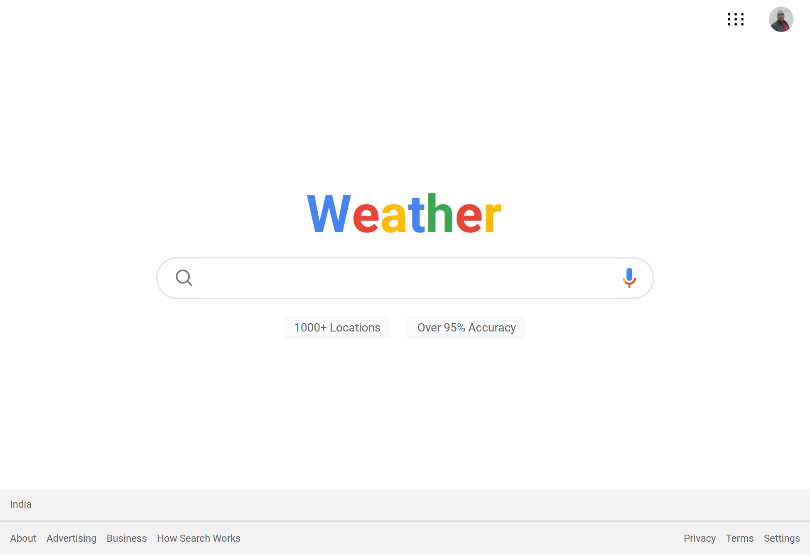
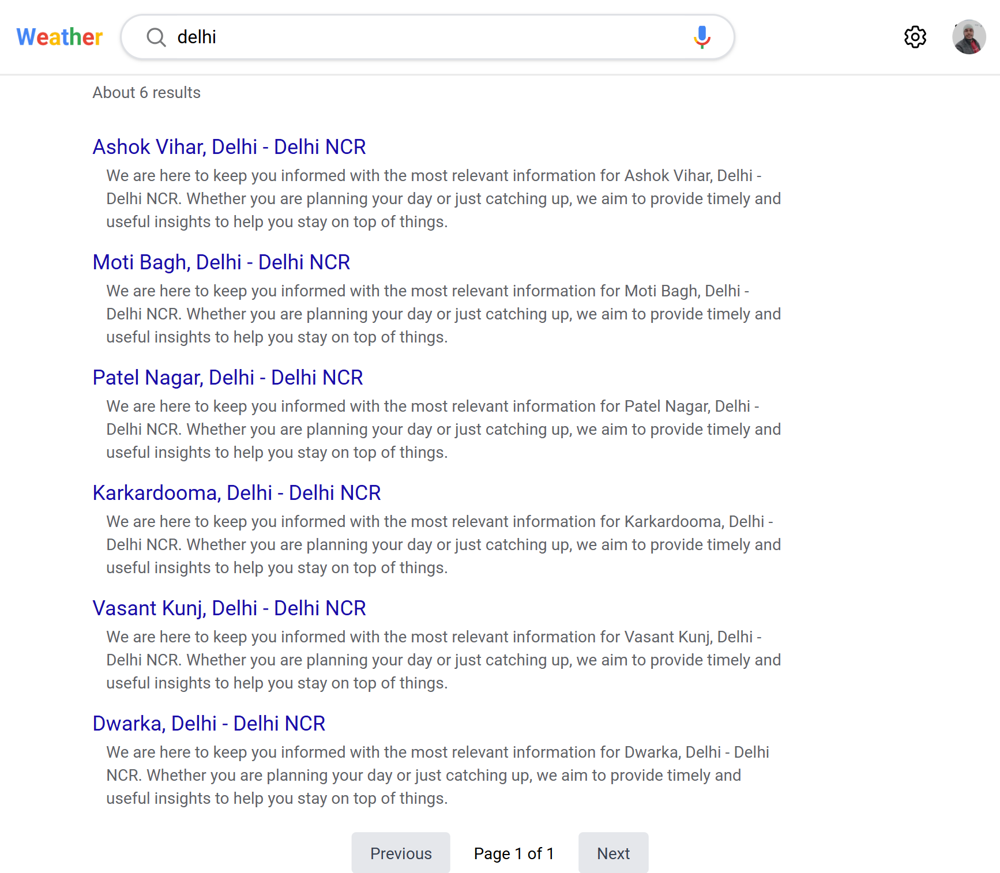
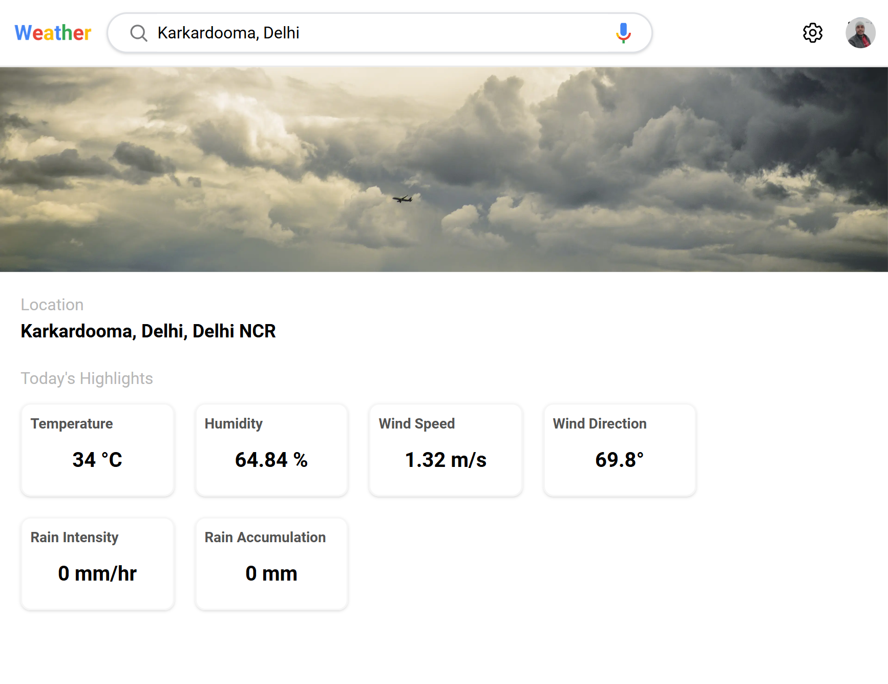

### Features
This application allows users to search for localities and view detailed weather forecasts with ease. Key features include:
- Search for Localities: Quickly find specific localities using a search feature. Get auto-suggestions as you type to help you find the exact location you're interested in.
- Weather Forecasts: View current weather conditions and forecasts for any locality. The application provides detailed information including temperature, humidity, wind speed, and more.


### Highlights
- Readable and Maintainable Code: Our codebase follows best practices, making it easy to read, maintain, and extend
- Responsive Design: All pages are designed with responsiveness in mind, providing a consistent experience across desktops, tablets, and mobile devices.
- Server and Client Components: Nexstore utilizes the power of Next.js with both server and client components to optimize rendering and improve performance. Server-side rendering (SSR) ensures that pages load quickly and are SEO-friendly, while client-side components enable dynamic interactions and real-time updates.


## A sneak peek into what we have here!

Visit the website at: https://olog-n-assignment.vercel.app/

### Home Page (Desktp view)


### Search Page 


### Weather Forecast Page



## Technology Stack

- **Coding Languages**:   

- **Tools & Frameworks**: 
 


- **Project Management Tools**:  

<hr>

## Environment Setup for local use-

- Download and install a code/ text editor. - Recommended- - [Download VS Code](https://code.visualstudio.com/download) 
  <br/>

- Download [Node Js and npm(Node package manager)](https://nodejs.org/en/) (when you install Node, npm also gets installed by default)
  <br/>


- Download and extract the github repository
<br/>

- Open the project (olgn Assignment-main) using VS Code
  <br/>

- Open a new terminal and enter `cd frontend` to navigate to the front end of the project
<br/>

- Run this command to install all dependencies for the frontend of this project.

```
npm install
```

<br/>

- Now run this command to start the project.

```
npm run dev
```
<br/>

- Now you are all set to use this project.

## Developer

- Md Riyaz Ahmed